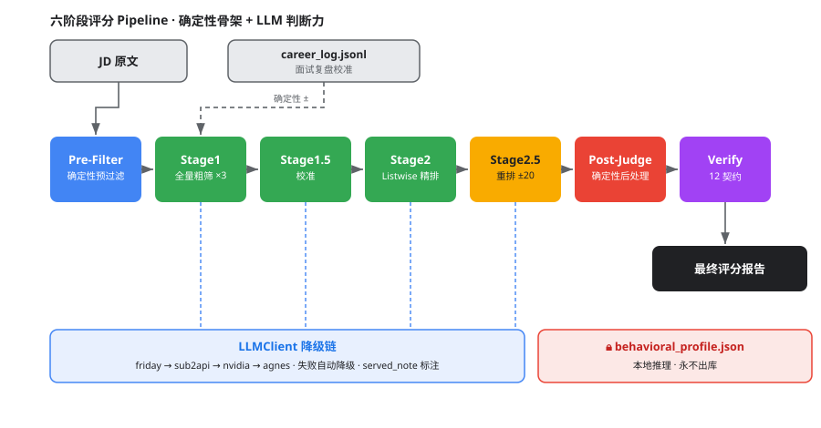

# Career Copilot

> 求职全链路 AI 评分引擎与陪练 Skill —— 把「岗位匹配 / 简历优化 / 面试准备 / 职业记忆」做成一条**可验证、可降级、可审计**的六阶段评分 pipeline。
> *Career Copilot: a verifiable, resilient, auditable 6-stage scoring pipeline for end-to-end job-search assistance.*

> 运行时入口是 `SKILL.md`（Agent 加载它即为事实源）。本文件是给访客/面试官看的工程说明。

<p align="center">
  <a href="#career-copilot">🇨🇳 中文</a> &nbsp;·&nbsp; <a href="#english">🇺🇸 English</a>
</p>

---

## 1. 六阶段评分 Pipeline（架构）

模型只负责「判断」，代码负责「约束」。整条链路是**确定性骨架 + LLM 判断力**的组合：每一阶段产出可被下一阶段消费，最终由 12 项契约断言兜底。



| 阶段 | 职责 | 模型 / 温度 | 关键设计 |
|---|---|---|---|
| **Pre-Filter** | 方向词检测、英语硬门槛、年限提取、垃圾/诈骗信号、过短 JD 丢弃 | 纯确定性 | 不消费 token，先砍掉明显不相关 |
| **Stage1 粗筛** | 全量打分，三变体 `general/strict/lenient` 取一致 | 便宜模型 · `temp=0.0` | `direction_anchor` 占权重 40%；三变体降低单模型方差 |
| **Stage1.5 校准** | 动态生成「辨别知识」辅助后续精排 | LLM | calibration，减少 Stage2 误判 |
| **Stage2 精排** | Listwise 分组重排 + 风险标注 | 较强模型 | 分组比较，输出风险标签 |
| **Stage2.5 重排** | 全局重排，**以 Stage1 为锚 ±20 钳制** | LLM | `RERANK_MAX_DEVIATION=20`，防止精排过度偏离粗筛共识 |
| **Post-Judge** | 确定性后处理 | 代码 | 英语三级惩罚 / 核心团队+学历降级 / 技术依赖检测 / A 档比例上限 |
| **Verify** | 12 项契约断言 | 代码 | `[C1]…[C12]`，A 档上限与 Post-Judge 共用 `config/constraints.yaml` |

---

## 2. 核心能力

1. **岗位匹配评分** —— 六阶段 pipeline 对 JD 与简历做可解释匹配，输出分级（A/B/C）与理由。
2. **简历优化** —— 基于匹配缺口生成简历改写建议与草稿。
3. **面试准备** —— 针对目标岗位生成面试问题与陪练材料。
4. **职业记忆** —— `career_log.jsonl` 沉淀历史投递/面试轨迹，跨会话复用。
5. **面试复盘校准闭环** —— `history_calibration` 从复盘提取 `boost_terms / low_pass_directions`，做**确定性加减分**（命中 +4 封顶 12，方向不符 −8 封顶 12），默认关闭、零 LLM 调用。
6. **可靠性工程** —— 多 Provider 降级、熔断、重试分类、语义缓存，见 §3。

---

## 3. 可靠性设计（工程重点）

> 设计哲学：**模型负责判断力，代码负责约束力。** 任何「不可信输入」与「不可逆决策」都由确定性代码兜底。

- **JD 零信任**：`jd_guard.sanitize_jd()` 在每条 JD 消费前强制剥离 4 类注入模式（元指令 / 动作指令 / 分隔符注入 / 数据外泄），命中整行删除。招聘数据被视为不可信输入。
- **确定性后处理（Post-Judge）**：英语三级惩罚（fluent / preferred / implicit）、核心团队+学历降级、技术依赖检测、`enforce_distribution()` 强制 A 档比例上限（从 `config/constraints.yaml` 单一事实源读 `a_tier_cap=25%`，保底 3 个）。
- **降级显式标注**：`LLMClient.served_note()` 在每次响应标注实际服务的 Provider；本地隐私模型打 WARNING。任何降级都在输出里**可见、可审计**，不静默伪装。
- **熔断**：`circuit_breaker_threshold=0.30` 且 `circuit_min_samples=5`，按 `failed/processed` 而非 `failed/total` 计算失败率，避免小样本误杀。
- **12 项输出契约**：`verify_output.run_checks()` 从 `[C1]` 顶层结构到 `[C12]` fallback≤15% 全量断言；`[C4]` A 档上限与 Post-Judge 共用 `constraints.yaml`；`[C9]` 踩过「干净批次 0 penalties 误杀」坑后降级为 WARNING。
- **重试分类**：`AuthError` 不重试；`Timeout` 2s 快重试；`RateLimit` 尊重 `retry-after`；其余指数退避 + jitter ±50%。
- **Provider 降级链**：`friday → sub2api → nvidia → agnes`（可用 `LLM_FAILOVER_CHAIN` 覆盖）。
- **语义缓存**：SHA256 文件缓存，TTL 7 天，相同请求不重复消费。
- **四层 JSON 恢复**：LLM 输出解析失败时逐层回退，Layer4 正则兜底返回 `{"score": int, "is_fallback": True}`，绝不因格式问题崩链路。

---

## 4. 评测与质量门禁

- **静态契约**：`verify_output.py` 在每次产出后跑 12 项断言，CI 可拦截不合规输出。
- **抓取质量守门**：`run_pipeline.py` 的 `quality_gate_check`（Phase 4.3）默认 report-only，可 `--quality-gate-fail` 硬拦截低质量抓取。
- **评测产物**：`evals/transcripts/` 保留盲评/复盘的脱敏转录，用于回归比对。
- **Golden cases + 跨模型盲评**：10 个黄金用例（`evals/golden/case_001..010.json`）已按分级规则（90+/85–89=A/72–84=B/<72=C）标注；跨模型独立盲评方法论见 [`evals/CROSS_MODEL_BLIND_EVAL.md`](evals/CROSS_MODEL_BLIND_EVAL.md) —— 对 Provider 链（friday / sub2api / nvidia / agnes）逐模型独立跑分并盲聚合比较。门禁：MAE≤8、ρ≥0.85、TierAcc≥80%、Outlier≤10%。盲评实测需配置密钥后运行，结论随跑分补齐（不在无 key 环境虚构）。

---

## 5. 5 分钟 Quick Start

```bash
# 0. 环境检测：确认依赖与 Provider key 就绪
python scripts/check_env.py

# 1. 安装依赖（建议虚拟环境）
pip install -r requirements.txt

# 2. 配置 Provider（环境变量，不落明文）
export LLM_FAILOVER_CHAIN="friday,sub2api,nvidia,agnes"
export FRIDAY_API_KEY="..."
# 缺失 key 时，LLMClient 在构造阶段即抛清晰错误，不会静默失败

# 3. 帮我建档：从简历生成职业画像与竞争力基线
python scripts/gen_profile.py --resume path/to/resume.pdf --output-dir ./profile
python scripts/career_log.py init

# 4. 帮我匹配岗位：跑端到端 pipeline，得到 A/B/C 分级评分
python scripts/run_pipeline.py --resume-from fetch --incremental
```

> 详细运行参数见 `SKILL.md` 与各 `scripts/*.py` 的 `--help`。

---

## 6. 目录结构（要点）

```
career-copilot/
├── SKILL.md                 # 运行时事实源（Agent 加载入口）
├── config/
│   └── constraints.yaml     # 单一事实源：A 档比例上限等约束
├── scripts/
│   ├── smart_score.py       # 六阶段主流程 run_pipeline()
│   ├── run_pipeline.py      # 端到端编排（fetch→score→draft→compile→verify→track→notify→report）
│   ├── llm_client.py        # 多 Provider 降级 / 重试分类 / 语义缓存
│   ├── pre_filter.py        # 确定性预过滤
│   ├── jd_guard.py          # JD 零信任注入剥离
│   ├── post_judge.py        # 确定性后处理
│   └── verify_output.py     # 12 项输出契约
├── evals/transcripts/       # 盲评/复盘脱敏转录
└── references/              # 行为画像等参考文档（示例，非个人数据）
```

---

## 7. 设计哲学

1. **判断力给模型，约束力给代码。** LLM 不该是唯一真相源；不可信输入与不可逆决策必须由确定性代码兜底。
2. **降级要可见，不要静默。** 任何 Provider 降级、fallback、钳制都在输出里标注，便于审计与信任校准。
3. **评分要可解释、可复现。** 三变体粗筛 + 锚定钳制降低方差；确定性后处理保证分布可控。
4. **故障要优雅，不静默崩溃。** 任一 Provider 或解析失败都有确定性兜底路径，异常被记录而非掩盖，评分不被污染。

---

## 8. License 与合规

- 代码以仓库 LICENSE 文件为准（详见根目录 `LICENSE`）。
- **个人行为画像 `behavioral_profile.json` 永不出库**（已被 `.gitignore` 永久排除）；仓库仅含 `config/behavioral_profile.example.json` 示例。
- JD / 招聘数据为公开信息，按项目约定保留，不视为敏感数据。

---

## English

> **Career Copilot** — an end-to-end AI scoring engine and coaching Skill for job hunting, turning *role matching / resume optimization / interview prep / career memory* into a single **verifiable, resilient, auditable** 6-stage scoring pipeline.

> The runtime entry point is `SKILL.md` (loaded by the Agent as the source of truth). This file is the engineering write-up for visitors and contributors.

---
## 1. The 6-Stage Scoring Pipeline (Architecture)

The model is responsible for *judgment*; the code is responsible for *constraints*. The whole chain is a **deterministic skeleton + LLM judgment** combo: each stage's output feeds the next, and 12 contract assertions backstop the final result.


| Stage | Responsibility | Model / Temp | Key design |
|---|---|---|---|
| **Pre-Filter** | direction-term detection, English hard gate, years extraction, spam/fraud signals, drop too-short job descriptions (JDs) | pure deterministic | spends no tokens; cuts obviously-irrelevant JDs first |
| **Stage1 coarse** | full-volume scoring; 3 variants `general/strict/lenient` take the consensus | cheap model · `temp=0.0` | `direction_anchor` weights 40%; 3 variants reduce single-model variance |
| **Stage1.5 calibration** | dynamically generate "discriminative knowledge" to aid later fine-ranking | LLM | calibration; reduces Stage2 misjudgment |
| **Stage2 fine-rank** | Listwise grouped rerank + risk tagging | stronger model | grouped comparison; outputs risk labels |
| **Stage2.5 rerank** | global rerank, **Stage1-anchored ±20 clamp** | LLM | `RERANK_MAX_DEVIATION=20`; prevents fine-rank from drifting too far from coarse consensus |
| **Post-Judge** | deterministic post-processing | code | English 3-tier penalty / core-team+degree downgrade / tech-dependency detection / A-tier ratio cap |
| **Verify** | 12 contract assertions | code | `[C1]…[C12]`; A-tier cap shares `config/constraints.yaml` with Post-Judge |

---

## 2. Core Capabilities

1. **Role-match scoring** — the 6-stage pipeline produces explainable matches between JD and resume, outputting a tier (A/B/C) and rationale.
2. **Resume optimization** — generates resume rewrite suggestions and drafts based on match gaps.
3. **Interview prep** — generates interview questions and coaching material for target roles.
4. **Career memory** — `career_log.jsonl` accumulates historical applications/interview trails, reusable across sessions.
5. **Interview-calibration loop** — `history_calibration` extracts `boost_terms / low_pass_directions` from reviews and applies **deterministic +/- scoring** (each hit +4, total capped at 12; each direction mismatch −8, total capped at 12), off by default, zero LLM calls.
6. **Reliability engineering** — multi-provider failover, circuit breaker, retry classification, semantic cache; see §3.

---

## 3. Reliability Design (Engineering Focus)

> Design philosophy: **the model owns judgment, the code owns constraints.** Any *untrusted input* or *irreversible decision* is backstopped by deterministic code.

- **Zero-trust JD**: `jd_guard.sanitize_jd()` strips 4 classes of injection patterns (meta-instruction / action-instruction / delimiter-injection / exfiltration) line-by-line before each JD is consumed. Recruiting data is treated as untrusted input.
- **Deterministic post-processing (Post-Judge)**: English 3-tier penalty (fluent / preferred / implicit), core-team+degree downgrade, tech-dependency detection, `enforce_distribution()` enforces A-tier ratio cap (reads `a_tier_cap=25%` from the single source of truth `config/constraints.yaml`, floor 3).
- **Visible degradation**: `LLMClient.served_note()` tags the actually-serving Provider on every response; local privacy models log WARNING. Any failover is **visible and auditable** in the output — never silently faked.
- **Circuit breaker**: `circuit_breaker_threshold=0.30` and `circuit_min_samples=5`, failure rate computed as `failed/processed` (not `failed/total`) to avoid small-sample false kills.
- **12 output contracts**: `verify_output.run_checks()` asserts everything from `[C1]` top-level structure to `[C12]` fallback≤15%; `[C4]` A-tier cap shares `constraints.yaml` with Post-Judge; `[C9]` was downgraded to WARNING after the "clean batch, 0 penalties, false-kill" incident.
- **Retry classification**: `AuthError` no retry; `Timeout` 2s fast retry; `RateLimit` respects `retry-after`; others exponential backoff + jitter ±50%.
- **Provider failover chain**: `friday → sub2api → nvidia → agnes` (overridable via `LLM_FAILOVER_CHAIN`).
- **Semantic cache**: SHA256 file cache, TTL 7 days; identical requests don't re-consume tokens.
- **4-layer JSON recovery**: on LLM output parse failure, fall back layer by layer; Layer4 regex backstop returns `{"score": int, "is_fallback": True}` so a formatting issue never breaks the chain.

---

## 4. Evaluation & Quality Gates

- **Static contracts**: `verify_output.py` runs 12 assertions after every output; CI can block non-compliant output.
- **Fetch quality gate**: `run_pipeline.py`'s `quality_gate_check` (Phase 4.3) is report-only by default, or `--quality-gate-fail` to hard-block low-quality fetches.
- **Evaluation artifacts**: `evals/transcripts/` keeps desensitized blind-eval / review transcripts for regression comparison.
- **Golden cases + cross-model blind eval**: 10 golden cases (`evals/golden/case_001..010.json`) are annotated with `expected_score` / `expected_tier` following the tier rule (90+ / 85–89 = A, 72–84 = B, <72 = C). The cross-model blind-eval methodology is documented in `evals/CROSS_MODEL_BLIND_EVAL.md` — run `evals/run_accuracy_eval.py` across the provider chain (friday / sub2api / nvidia / agnes) and compare results independently. Gate thresholds (verified by running with configured keys; results are filled in after evaluation, never fabricated): MAE≤8, ρ≥0.85, TierAcc≥80%, Outlier≤10%.

---

## 5. Quick Start

```bash
# 0. Detect environment: confirm dependencies and provider keys are ready
python scripts/check_env.py

# 1. Install dependencies (virtualenv recommended)
pip install -r requirements.txt

# 2. Configure providers (env vars, no plaintext secrets)
export LLM_FAILOVER_CHAIN="friday,sub2api,nvidia,agnes"
export FRIDAY_API_KEY="..."
# Missing key -> LLMClient raises a clear error at construction, never fails silently

# 3. Build my profile: generate career profile and competitiveness baseline from a resume
python scripts/gen_profile.py --resume path/to/resume.pdf --output-dir ./profile
python scripts/career_log.py init

# 4. Match roles for me: run the end-to-end pipeline for an A/B/C tiered score
python scripts/run_pipeline.py --resume-from fetch --incremental
```

> Detailed run flags: see `SKILL.md` and `--help` on each `scripts/*.py`.

---

## 6. Directory Layout (Key Parts)

```
career-copilot/
├── SKILL.md                 # runtime source of truth (Agent load entry)
├── config/
│   └── constraints.yaml     # single source of truth: A-tier cap etc.
├── scripts/
│   ├── smart_score.py       # 6-stage main flow run_pipeline()
│   ├── run_pipeline.py      # orchestration (fetch→score→draft→compile→verify→track→notify→report)
│   ├── llm_client.py        # multi-provider failover / retry classification / semantic cache
│   ├── pre_filter.py        # deterministic prefilter
│   ├── jd_guard.py          # zero-trust JD injection stripping
│   ├── post_judge.py        # deterministic post-processing
│   └── verify_output.py     # 12 output contracts
├── evals/
│   ├── golden/              # golden cases (case_001..010.json)
│   └── CROSS_MODEL_BLIND_EVAL.md  # cross-model blind-eval methodology
└── references/              # reference docs e.g. behavior profile (examples, not personal data)
```

---

## 7. Design Philosophy

1. **Judgment to the model, constraints to the code.** The LLM should not be the sole source of truth; untrusted input and irreversible decisions must be backstopped by deterministic code.
2. **Degradation is visible, not silent.** Any provider failover, fallback, or clamp is tagged in the output for audit and trust calibration.
3. **Scoring is explainable and reproducible.** 3-variant coarse screen + anchored clamp reduce variance; deterministic post-processing keeps distribution controllable.
4. **Failures are graceful, never silent.** Any provider or parse failure has a deterministic fallback path; anomalies are logged, not hidden, and never pollute the score.

---

## 8. License & Compliance

- Code is governed by the repo's `LICENSE` file (see root `LICENSE`).
- **The personal behavior profile `behavioral_profile.json` never enters the repo** (permanently excluded by `.gitignore`); the repo only ships `config/behavioral_profile.example.json`.
- JD / recruiting data are public information, retained per project convention and not treated as sensitive.
