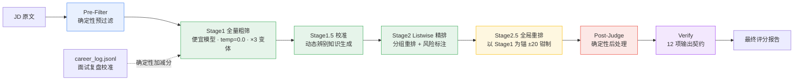

# Career Copilot

> 求职全链路 AI 评分引擎与陪练 Skill —— 把「岗位匹配 / 简历优化 / 面试准备 / 职业记忆」做成一条**可验证、可降级、可审计**的六阶段评分 pipeline。
> *Career Copilot: a verifiable, degradable, auditable 6-stage scoring pipeline for end-to-end job-search assistance.*

> 运行时入口是 `SKILL.md`（Agent 加载它即为事实源）。本文件是给访客/面试官看的工程说明。
> *English version: [README_EN.md](README_EN.md).*

---

## 1. 六阶段评分 Pipeline（架构）

模型只负责「判断」，代码负责「约束」。整条链路是**确定性骨架 + LLM 判断力**的组合：每一阶段产出可被下一阶段消费，最终由 12 项契约断言兜底。



| 阶段 | 职责 | 模型 / 温度 | 关键设计 |
|---|---|---|---|
| **Pre-Filter** | 方向词检测、英语硬门槛、年限提取、垃圾/诈骗信号、过短 JD 丢弃 | 纯确定性 | 不消费 token，先砍掉明显不相关 |
| **Stage1 粗筛** | 全量打分，三变体 `general/strict/lenient` 取一致 | 便宜模型 · `temp=0.0` | `direction_anchor` 占权重 40%；三变体降低单模型方差 |
| **Stage1.5 校准** | 动态生成「辨别知识」辅助后续精排 | LLM | calibration，减少 Stage2 误判 |
| **Stage2 精排** | Listwise 分组重排 + 风险标注 | 较强模型 | 分组比较，输出风险标签 |
| **Stage2.5 重排** | 全局重排，**以 Stage1 为锚 ±20 钳制** | LLM | `RERANK_MAX_DEVIATION=20`，防止精排过度偏离粗筛共识 |
| **Post-Judge** | 确定性后处理 | 代码 | 英语三级惩罚 / 核心团队+学历降级 / 技术依赖检测 / A 档比例上限 |
| **Verify** | 12 项契约断言 | 代码 | `[C1]…[C12]`，A 档上限与 Post-Judge 共用 `config/constraints.yaml` |

---

## 2. 核心能力

1. **岗位匹配评分** —— 六阶段 pipeline 对 JD 与简历做可解释匹配，输出分级（A/B/C）与理由。
2. **简历优化** —— 基于匹配缺口生成简历改写建议与草稿。
3. **面试准备** —— 针对目标岗位生成面试问题与陪练材料。
4. **职业记忆** —— `career_log.jsonl` 沉淀历史投递/面试轨迹，跨会话复用。
5. **面试复盘校准闭环** —— `history_calibration` 从复盘提取 `boost_terms / low_pass_directions`，做**确定性加减分**（命中 +4 封顶 12，方向不符 −8 封顶 12），默认关闭、零 LLM 调用。
6. **可靠性工程** —— 多 Provider 降级、熔断、重试分类、语义缓存，见 §3。

---

## 3. 可靠性设计（工程重点）

> 设计哲学：**模型负责判断力，代码负责约束力。** 任何「不可信输入」与「不可逆决策」都由确定性代码兜底。

- **JD 零信任**：`jd_guard.sanitize_jd()` 在每条 JD 消费前强制剥离 4 类注入模式（元指令 / 动作指令 / 分隔符注入 / 数据外泄），命中整行删除。招聘数据被视为不可信输入。
- **确定性后处理（Post-Judge）**：英语三级惩罚（fluent / preferred / implicit）、核心团队+学历降级、技术依赖检测、`enforce_distribution()` 强制 A 档比例上限（从 `config/constraints.yaml` 单一事实源读 `a_tier_cap=25%`，保底 3 个）。
- **降级显式标注**：`LLMClient.served_note()` 在每次响应标注实际服务的 Provider；本地隐私模型打 WARNING。任何降级都在输出里**可见、可审计**，不静默伪装。
- **熔断**：`circuit_breaker_threshold=0.30` 且 `circuit_min_samples=5`，按 `failed/processed` 而非 `failed/total` 计算失败率，避免小样本误杀。
- **12 项输出契约**：`verify_output.run_checks()` 从 `[C1]` 顶层结构到 `[C12]` fallback≤15% 全量断言；`[C4]` A 档上限与 Post-Judge 共用 `constraints.yaml`；`[C9]` 踩过「干净批次 0 penalties 误杀」坑后降级为 WARNING。
- **重试分类**：`AuthError` 不重试；`Timeout` 2s 快重试；`RateLimit` 尊重 `retry-after`；其余指数退避 + jitter ±50%。
- **Provider 降级链**：`friday → sub2api → nvidia → agnes`（可用 `LLM_FAILOVER_CHAIN` 覆盖）。
- **语义缓存**：SHA256 文件缓存，TTL 7 天，相同请求不重复消费。
- **四层 JSON 恢复**：LLM 输出解析失败时逐层回退，Layer4 正则兜底返回 `{"score": int, "is_fallback": True}`，绝不因格式问题崩链路。

---

## 4. 评测与质量门禁

- **静态契约**：`verify_output.py` 在每次产出后跑 12 项断言，CI 可拦截不合规输出。
- **抓取质量守门**：`run_pipeline.py` 的 `quality_gate_check`（Phase 4.3）默认 report-only，可 `--quality-gate-fail` 硬拦截低质量抓取。
- **评测产物**：`evals/transcripts/` 保留盲评/复盘的脱敏转录，用于回归比对。
- **Golden cases + 跨模型盲评**：10 个黄金用例（`evals/golden/case_001..010.json`）已按分级规则（90+/85–89=A/72–84=B/<72=C）标注；跨模型独立盲评方法论见 [`evals/CROSS_MODEL_BLIND_EVAL.md`](evals/CROSS_MODEL_BLIND_EVAL.md) —— 对 Provider 链（friday / sub2api / nvidia / agnes）逐模型独立跑分并盲聚合比较。门禁：MAE≤8、ρ≥0.85、TierAcc≥80%、Outlier≤10%。盲评实测需配置密钥后运行，结论随跑分补齐（不在无 key 环境虚构）。

---

## 5. 5 分钟 Quick Start

```bash
# 0. 环境检测：确认依赖与 Provider key 就绪
python scripts/check_env.py

# 1. 安装依赖（建议虚拟环境）
pip install -r requirements.txt

# 2. 配置 Provider（环境变量，不落明文）
export LLM_FAILOVER_CHAIN="friday,sub2api,nvidia,agnes"
export FRIDAY_API_KEY="..."
# 缺失 key 时，LLMClient 在构造阶段即抛清晰错误，不会静默失败

# 3. 帮我建档：从简历生成职业画像与竞争力基线
python scripts/gen_profile.py --resume path/to/resume.pdf --output-dir ./profile
python scripts/career_log.py init

# 4. 帮我匹配岗位：跑端到端 pipeline，得到 A/B/C 分级评分
python scripts/run_pipeline.py --resume-from fetch --incremental
```

> 详细运行参数见 `SKILL.md` 与各 `scripts/*.py` 的 `--help`。

---

## 6. 目录结构（要点）

```
career-copilot/
├── SKILL.md                 # 运行时事实源（Agent 加载入口）
├── config/
│   └── constraints.yaml     # 单一事实源：A 档比例上限等约束
├── scripts/
│   ├── smart_score.py       # 六阶段主流程 run_pipeline()
│   ├── run_pipeline.py      # 端到端编排（fetch→score→draft→compile→verify→track→notify→report）
│   ├── llm_client.py        # 多 Provider 降级 / 重试分类 / 语义缓存
│   ├── pre_filter.py        # 确定性预过滤
│   ├── jd_guard.py          # JD 零信任注入剥离
│   ├── post_judge.py        # 确定性后处理
│   └── verify_output.py     # 12 项输出契约
├── evals/transcripts/       # 盲评/复盘脱敏转录
└── references/              # 行为画像等参考文档（示例，非个人数据）
```

---

## 7. 设计哲学

1. **判断力给模型，约束力给代码。** LLM 不该是唯一真相源；不可信输入与不可逆决策必须由确定性代码兜底。
2. **降级要可见，不要静默。** 任何 Provider 降级、fallback、钳制都在输出里标注，便于审计与信任校准。
3. **评分要可解释、可复现。** 三变体粗筛 + 锚定钳制降低方差；确定性后处理保证分布可控。
4. **面试官的视角 = 工程深度 > 营销话术。** 本仓库刻意做成可审计的系统，而非演示玩具。

---

## 8. License 与合规

- 代码以仓库 LICENSE 文件为准（详见根目录 `LICENSE`）。
- **个人行为画像 `behavioral_profile.json` 永不出库**（已被 `.gitignore` 永久排除）；仓库仅含 `config/behavioral_profile.example.json` 示例。
- JD / 招聘数据为公开信息，按项目约定保留，不视为敏感数据。

---
