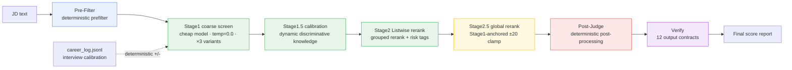

# Career Copilot

> An end-to-end AI scoring engine and coaching Skill for job hunting — turning *role matching / resume optimization / interview prep / career memory* into a single **verifiable, degradable, auditable** 6-stage scoring pipeline.
> *Career Copilot: a verifiable, degradable, auditable 6-stage scoring pipeline for end-to-end job-search assistance.*

> The runtime entry point is `SKILL.md` (loaded by the Agent as the source of truth). This file is the engineering write-up for visitors / interviewers.

---

## 1. The 6-Stage Scoring Pipeline (Architecture)

The model is responsible for *judgment*; the code is responsible for *constraints*. The whole chain is a **deterministic skeleton + LLM judgment** combo: each stage's output feeds the next, and 12 contract assertions backstop the final result.



| Stage | Responsibility | Model / Temp | Key design |
|---|---|---|---|
| **Pre-Filter** | direction-term detection, English hard gate, years extraction, spam/fraud signals, drop too-short JD | pure deterministic | spends no tokens; cuts obviously-irrelevant JD first |
| **Stage1 coarse** | full-volume scoring; 3 variants `general/strict/lenient` take the consensus | cheap model · `temp=0.0` | `direction_anchor` weights 40%; 3 variants reduce single-model variance |
| **Stage1.5 calibration** | dynamically generate "discriminative knowledge" to aid later fine-ranking | LLM | calibration; reduces Stage2 misjudgment |
| **Stage2 fine-rank** | Listwise grouped rerank + risk tagging | stronger model | grouped comparison; outputs risk labels |
| **Stage2.5 rerank** | global rerank, **Stage1-anchored ±20 clamp** | LLM | `RERANK_MAX_DEVIATION=20`; prevents fine-rank from drifting too far from coarse consensus |
| **Post-Judge** | deterministic post-processing | code | English 3-tier penalty / core-team+degree downgrade / tech-dependency detection / A-tier ratio cap |
| **Verify** | 12 contract assertions | code | `[C1]…[C12]`; A-tier cap shares `config/constraints.yaml` with Post-Judge |

---

## 2. Core Capabilities

1. **Role-match scoring** — the 6-stage pipeline produces explainable matches between JD and resume, outputting a tier (A/B/C) and rationale.
2. **Resume optimization** — generates resume rewrite suggestions and drafts based on match gaps.
3. **Interview prep** — generates interview questions and coaching material for target roles.
4. **Career memory** — `career_log.jsonl` accumulates historical applications/interview trails, reusable across sessions.
5. **Interview-calibration loop** — `history_calibration` extracts `boost_terms / low_pass_directions` from reviews and applies **deterministic +/- scoring** (hit +4 cap 12, direction-mismatch −8 cap 12), off by default, zero LLM calls.
6. **Reliability engineering** — multi-provider failover, circuit breaker, retry classification, semantic cache; see §3.

---

## 3. Reliability Design (Engineering Focus)

> Design philosophy: **the model owns judgment, the code owns constraints.** Any *untrusted input* or *irreversible decision* is backstopped by deterministic code.

- **Zero-trust JD**: `jd_guard.sanitize_jd()` strips 4 classes of injection patterns (meta-instruction / action-instruction / delimiter-injection / exfiltration) line-by-line before each JD is consumed. Recruiting data is treated as untrusted input.
- **Deterministic post-processing (Post-Judge)**: English 3-tier penalty (fluent / preferred / implicit), core-team+degree downgrade, tech-dependency detection, `enforce_distribution()` enforces A-tier ratio cap (reads `a_tier_cap=25%` from the single source of truth `config/constraints.yaml`, floor 3).
- **Visible degradation**: `LLMClient.served_note()` tags the actually-serving Provider on every response; local privacy models log WARNING. Any failover is **visible and auditable** in the output — never silently faked.
- **Circuit breaker**: `circuit_breaker_threshold=0.30` and `circuit_min_samples=5`, failure rate computed as `failed/processed` (not `failed/total`) to avoid small-sample false kills.
- **12 output contracts**: `verify_output.run_checks()` asserts everything from `[C1]` top-level structure to `[C12]` fallback≤15%; `[C4]` A-tier cap shares `constraints.yaml` with Post-Judge; `[C9]` was downgraded to WARNING after the "clean batch, 0 penalties, false-kill" incident.
- **Retry classification**: `AuthError` no retry; `Timeout` 2s fast retry; `RateLimit` respects `retry-after`; others exponential backoff + jitter ±50%.
- **Provider failover chain**: `friday → sub2api → nvidia → agnes` (overridable via `LLM_FAILOVER_CHAIN`).
- **Semantic cache**: SHA256 file cache, TTL 7 days; identical requests don't re-consume tokens.
- **4-layer JSON recovery**: on LLM output parse failure, fall back layer by layer; Layer4 regex backstop returns `{"score": int, "is_fallback": True}` so a formatting issue never breaks the chain.

---

## 4. Evaluation & Quality Gates

- **Static contracts**: `verify_output.py` runs 12 assertions after every output; CI can block non-compliant output.
- **Fetch quality gate**: `run_pipeline.py`'s `quality_gate_check` (Phase 4.3) is report-only by default, or `--quality-gate-fail` to hard-block low-quality fetches.
- **Evaluation artifacts**: `evals/transcripts/` keeps desensitized blind-eval / review transcripts for regression comparison.
- **Golden cases + cross-model blind eval**: 10 golden cases (`evals/golden/case_001..010.json`) are human/AI-annotated with `expected_score` / `expected_tier` following the tier rule (90+ / 85–89 = A, 72–84 = B, <72 = C). The cross-model blind-eval methodology is documented in `evals/CROSS_MODEL_BLIND_EVAL.md` — run `evals/run_accuracy_eval.py` across the provider chain (friday / sub2api / nvidia / agnes) and compare independently. Gate thresholds: MAE≤8, ρ≥0.85, TierAcc≥80%, Outlier≤10%.

---

## 5. Quick Start

```bash
# 0. Detect environment: confirm dependencies and provider keys are ready
python scripts/check_env.py

# 1. Install dependencies (virtualenv recommended)
pip install -r requirements.txt

# 2. Configure providers (env vars, no plaintext secrets)
export LLM_FAILOVER_CHAIN="friday,sub2api,nvidia,agnes"
export FRIDAY_API_KEY="..."
# Missing key -> LLMClient raises a clear error at construction, never fails silently

# 3. Build my profile: generate career profile and competitiveness baseline from a resume
python scripts/gen_profile.py --resume path/to/resume.pdf --output-dir ./profile
python scripts/career_log.py init

# 4. Match roles for me: run the end-to-end pipeline for an A/B/C tiered score
python scripts/run_pipeline.py --resume-from fetch --incremental
```

> Detailed run flags: see `SKILL.md` and `--help` on each `scripts/*.py`.

---

## 6. Directory Layout (Key Parts)

```
career-copilot/
├── SKILL.md                 # runtime source of truth (Agent load entry)
├── config/
│   └── constraints.yaml     # single source of truth: A-tier cap etc.
├── scripts/
│   ├── smart_score.py       # 6-stage main flow run_pipeline()
│   ├── run_pipeline.py      # orchestration (fetch→score→draft→compile→verify→track→notify→report)
│   ├── llm_client.py        # multi-provider failover / retry classification / semantic cache
│   ├── pre_filter.py        # deterministic prefilter
│   ├── jd_guard.py          # zero-trust JD injection stripping
│   ├── post_judge.py        # deterministic post-processing
│   └── verify_output.py     # 12 output contracts
├── evals/
│   ├── golden/              # golden cases (case_001..010.json)
│   └── CROSS_MODEL_BLIND_EVAL.md  # cross-model blind-eval methodology
└── references/              # reference docs e.g. behavior profile (examples, not personal data)
```

---

## 7. Design Philosophy

1. **Judgment to the model, constraints to the code.** The LLM should not be the sole source of truth; untrusted input and irreversible decisions must be backstopped by deterministic code.
2. **Degradation is visible, not silent.** Any provider failover, fallback, or clamp is tagged in the output for audit and trust calibration.
3. **Scoring is explainable and reproducible.** 3-variant coarse screen + anchored clamp reduce variance; deterministic post-processing keeps distribution controllable.
4. **From the interviewer's view: engineering depth > marketing talk.** This repo is deliberately an auditable system, not a demo toy.

---

## 8. License & Compliance

- Code is governed by the repo's `LICENSE` file (see root `LICENSE`).
- **The personal behavior profile `behavioral_profile.json` never enters the repo** (permanently excluded by `.gitignore`); the repo only ships `config/behavioral_profile.example.json`.
- JD / recruiting data are public information, retained per project convention and not treated as sensitive.

---

*This README was written by the executor under the principle "canonical open-source, engineering-first, not a marketing page"; the 6-stage constants (`RERANK_MAX_DEVIATION=20`, `a_tier_cap=25%`, breaker 30%/5, failover chain `friday→sub2api→nvidia→agnes`) are all read directly from source.*
